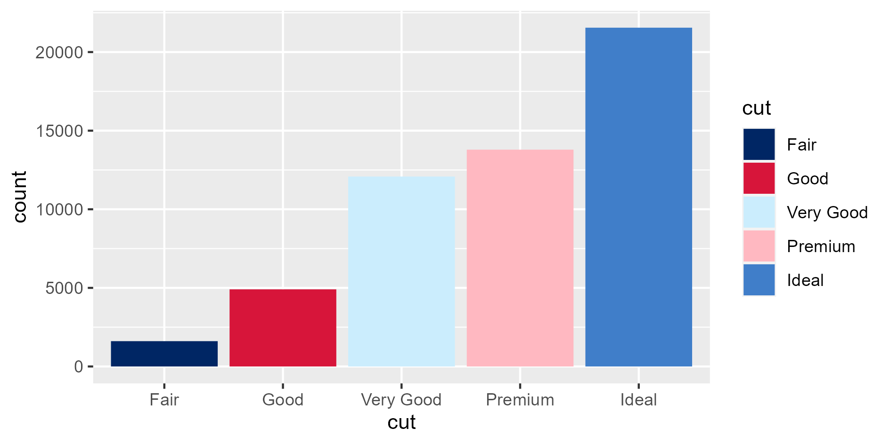

<!-- README.md is generated from README.Rmd. Please edit that file -->

```{r, include = FALSE}
knitr::opts_chunk$set(
  collapse = TRUE,
  comment = "#>",
  fig.path = "man/figures/README-",
  out.width = "100%"
)
```

# doestyle

<!-- badges: start -->
<!-- badges: end -->

`{doestyle}` is a collection of functions to help produce brand-compliant figures for NSW Department of Education publications.

## Installation

You can install the development version of doestyle from its Azure Devops git repository.

From your terminal:

```{bash eval = FALSE}
git clone https://doestyle@dev.azure.com/doestyle/doestyle/_git/doestyle
```

... and then from `R`:

```{r eval = FALSE}
remotes::install_local("path_to_where_you_cloned/doestyle")
```

## Example

Apply the DoE colour palette to the fill aesthetic of a bar chart:

```{r example, eval = FALSE}
library(ggplot2)
library(doestyle)

diamonds |>
  ggplot(aes(x = cut, fill = cut)) +
  geom_bar() +
  # Use the DoE fill scale
  scale_fill_doe()
```

```{r fig-example, echo = FALSE}
# Workaround for Azure Devops requirements for markdown-syntax image embeds
library(ggplot2)
library(doestyle)

fig_example <- diamonds |>
  ggplot(aes(x = cut, fill = cut)) +
  geom_bar() +
  # Use the DoE fill scale
  scale_fill_doe()

ggsave(filename = "man/figures/README-fig-example.png",
       plot = fig_example,
       width = 16,
       height = 8,
       units = "cm")
```



