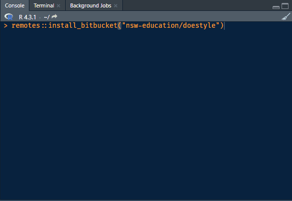
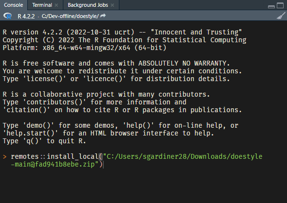

<!-- README.md is generated from README.Rmd. Please edit that file -->

# doestyle

<!-- badges: start -->

<!-- badges: end -->

`{doestyle}` is an R package containing functions to help produce
brand-compliant figures for NSW Department of Education publications.

## Installation

Because `doestyle` is not on yet on CRAN, it cannot be directly
installed with the standard `install.packages` function. Instead, we can
use the helper package
[remotes](https://cran.r-project.org/package=remotes) to either install
from BitBucket, or from a downloaded copy of the BitBucket repository.

There are currently two installation options, both of which rely on
`remotes`.

### Install directly from BitBucket

You can install the latest version of `doestyle` directly from its
Bitbucket repository.

**Prerequisites:**

-   Install the [Git version control system](https://git-scm.com/). If
    you are using a Department of Education device, it is easiest to
    install Git for Windows from the software centre.
-   Install the [remotes R
    package](https://cran.r-project.org/package=remotes) with
    `install.packages("remotes")`
-   If you are behind the Department of Education firewall, make sure
    that you have configured R to use the correct HTTP proxy.

**Steps:**

1.  In R, use `remotes` to install `doestyle` from its Git repository on
    BitBucket. This will be easiest from an R console in RStudio:

<!-- -->

    remotes::install_bitbucket("nsw-education/doestyle")

For example:

Example installation using remotes::install\_bitbucket()

You may be prompted to authenticate with BitBucket in a new window. Your
credentials will be your usual single-sign-on username and password.

The same command can be used to update `doestyle` to its latest version.

### Install from a downloaded copy

**Prerequisites:**

-   Install the [remotes R
    package](https://cran.r-project.org/package=remotes) with
    `install.packages("remotes")`

**Steps:**

1.  Download the current [doestyle repository zip
    file](https://bitbucket.org/nsw-education/doestyle/get/main.zip).
    Make a note of the path to the downloaded file.
2.  In R, use `remotes::install_local` to install `doestyle` from the
    downloaded zip file. If you are using Windows, you will need to
    transform the path you noted, converting any backslashes (“\\”) to
    forward slashes (“/”).

<!-- -->

    remotes::install_local("C:/path/to/your_downloads_folder/doestyle-file-you-noted.zip")

For example:

Example installation using remotes::install\_local()

At a later date, you will need to repeat both steps to update `doestyle`
to its latest version.

## Usage example

Apply the department’s colour palette to the fill aesthetic of a bar
chart:

    library(ggplot2)
    # Load doestyle
    library(doestyle)

    diamonds |>
      ggplot(aes(x = cut, fill = cut)) +
      geom_bar() +
      # Use the DoE fill scale
      scale_fill_doe() + 
      # Apply the DoE theme
      theme_doe()

The department has several different palettes available, which have been
constructed from the official colours. These are displayed below. The
default palette should be used when possible.

