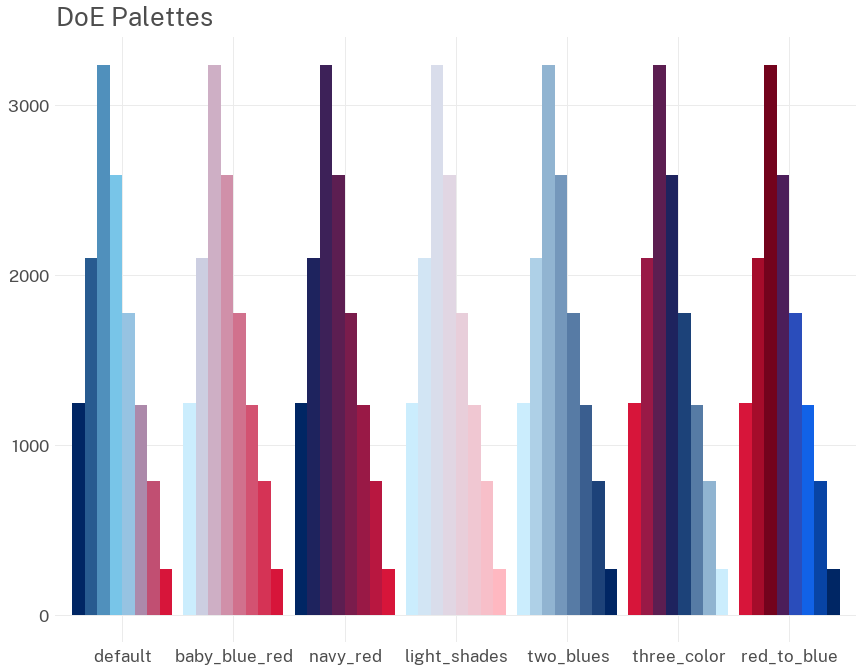

<!-- README.md is generated from README.Rmd. Please edit that file -->

# doestyle

<!-- badges: start -->

[](https://lifecycle.r-lib.org/articles/stages.html#experimental)
<!-- badges: end -->

`{doestyle}` is an R package containing functions to help produce
brand-compliant figures and tables for NSW Department of Education
publications. It is currently under active development, but already
includes features that ease the use of brand colours and typesettig in
`ggplot2` figures and `flextable` tables.

## Installation

`doestyle` can be installed with R’s standard `install.packages()`
function. Because `doestyle` is not yet on CRAN, you will need to
install its dependencies first, by following the instructions below.

To install `doestyle` run both of the following commands in your R
console:

``` r
# Install doestyle's dependencies from CRAN:
install.packages(c("cli", "dplyr", "flextable", "ggplot2", "glue", "officer", "palettes", "purrr", "showtext", "sysfonts"),
   type = "binary")
# Install doestyle from its URL:
install.packages("https://bitbucket.org/nsw-education/doestyle/downloads/doestyle_latest.tar.gz",
   type = "source")
```

If you’re using RStudio on Windows and it prompts you to restart R
before installing, select “No” - there is a [known RStudio
issue](https://github.com/rstudio/rstudio/issues/2656) around
reinstalling packages on Windows.

The same commands can be used to update your installed version of
`doestyle` if needed.

## Usage example

Apply the department’s colour palette to the fill aesthetic of a bar
chart:

``` r
library(ggplot2)
# Load doestyle
library(doestyle)

diamonds |>
  ggplot(aes(x = cut, fill = cut)) +
  geom_bar() +
  # Use the DoE fill scale
  scale_fill_doe() + 
  # Apply the DoE theme
  theme_doe()
```


The department has several different palettes available, which have been
constructed from the official colours. These are displayed below. The
default palette should be used when possible.


