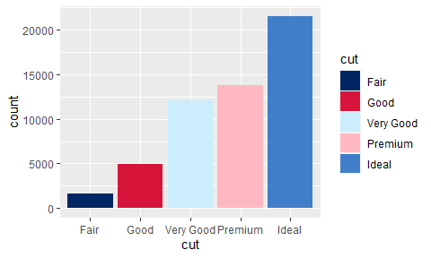

<!-- README.md is generated from README.Rmd. Please edit that file -->

# doestyle

<!-- badges: start -->
<!-- badges: end -->

`{doestyle}` is a collection of functions to help produce
brand-compliant figures for NSW Department of Education publications.

## Installation

You can install the development version of doestyle from its Azure
Devops git repository.

``` r
remotes::install_git("https://dev.azure.com/doestyle/_git/doestyle")
```

## Example

Apply the DoE colour palette to the fill aesthetic of a bar chart:

``` r
library(ggplot2)
library(doestyle)

diamonds |>
  ggplot(aes(x = cut, fill = cut)) +
  geom_bar() +
  # Use the DoE fill scale
  scale_fill_doe()
```


