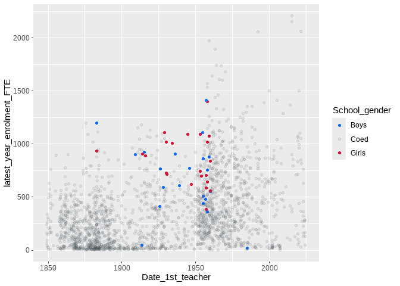

<!-- README.md is generated from README.Rmd. Please edit that file -->

# doestyle

<!-- badges: start -->

[](https://lifecycle.r-lib.org/articles/stages.html#experimental)
[](https://github.com/nsw-education/doestyle/actions/workflows/R-CMD-check.yaml)
<!-- badges: end -->

`{doestyle}` is an R package that helps produce brand-compliant figures
and tables for NSW Department of Education publications. It is under
development, but already includes features that ease the use of brand
colours and typesetting in `ggplot2` figures and `flextable` tables.

If you’re interested in contributing to development, please [read the
contributors’ guide](./CONTRIBUTING.md) and/or watch [contributing to
`doestyle`](https://schoolsnsw.sharepoint.com/:v:/s/DataVisWorkingGroup/EYthJPlfW4ZOhP-6aT0JrMABgWWB2bX_sEOVSlPMwlZwWg?e=OxCP6i&nav=eyJyZWZlcnJhbEluZm8iOnsicmVmZXJyYWxBcHAiOiJTdHJlYW1XZWJBcHAiLCJyZWZlcnJhbFZpZXciOiJTaGFyZURpYWxvZy1MaW5rIiwicmVmZXJyYWxBcHBQbGF0Zm9ybSI6IldlYiIsInJlZmVycmFsTW9kZSI6InZpZXcifX0%3D).

## Installation

Install the latest official release of `doestyle` with
`install.packages()`:

``` r
install.packages('doestyle', repos = c('https://nsw-education.r-universe.dev', 'https://cloud.r-project.org'))
```

Alternatively, install the latest in-development version from GitHub
with `remotes`:

``` r
# Install `remotes` if needed
if (!require("remotes")) install.packages("remotes")

# Install doestyle using `remotes`
remotes::install_github("nsw-education/doestyle")
```

## Usage examples

The following examples use data from the [Public Schools Master
Dataset](https://data.nsw.gov.au/data/dataset/nsw-education-nsw-public-schools-master-dataset),
which is available as a package dataset named `public_schools`.

``` r
library(tidyverse)
library(doestyle)

# The Public Schools Master Dataset
head(public_schools)
#> # A tibble: 6 × 45
#>   School_code AgeID School_name   Street Town_suburb Postcode Phone School_Email
#>   <chr>       <chr> <chr>         <chr>  <chr>       <chr>    <chr> <chr>       
#> 1 5423        <NA>  John Brotchi… 1361 … Botany      2019     9316… johnbrotch-…
#> 2 8600        86659 Secondary Co… Level… Parramatta  2150     02 7… SCLanguages…
#> 3 8473        46360 Chifley Coll… 67 No… MOUNT DRUI… 2770     9625… chifcolsnr-…
#> 4 8325        46407 Moree Second… Alber… Moree       2400     6752… mscalberts-…
#> 5 8870        46426 St Marys Sen… Kalan… St Marys    2760     9623… stmaryssen-…
#> 6 8374        46489 Brisbane Wat… 25 ED… WOY WOY     2256     4341… woywoy-h.sc…
#> # ℹ 37 more variables: Website <chr>, Fax <chr>,
#> #   latest_year_enrolment_FTE <dbl>, Indigenous_pct <dbl>, LBOTE_pct <dbl>,
#> #   ICSEA_value <dbl>, Level_of_schooling <chr>, Selective_school <chr>,
#> #   Opportunity_class <chr>, School_specialty_type <chr>, School_subtype <chr>,
#> #   Support_classes <lgl>, Preschool_ind <chr>, Distance_education <chr>,
#> #   Intensive_english_centre <chr>, School_gender <chr>,
#> #   Late_opening_school <chr>, Date_1st_teacher <date>, LGA <chr>, …
```

### Quick branding

`doestyle` provides the scale functions `scale_colour_doe()` and
`scale_fill_doe()` to easily apply brand colours to the colour or fill
aesthetics of a ggplot2 object.

For a default colour scale, apply `scale_colour_doe()` with no
arguments:

``` r
public_schools |>
  filter(Operational_directorate == "Metropolitan South and West") |>
  ggplot(aes(x = LBOTE_pct, y = FOEI_Value, colour = Intensive_english_centre)) +
  geom_point() +
  # Add a default department scale to the `colour` aesthetic. Note that `colour`
  # has already been mapped onto the value of `Intensive_english_centre` in this
  # plot's aesthetic mapping.
  scale_colour_doe()
```


An on-brand default fill scale can be applied with `scale_fill_doe()`.
Be aware that lighter colours, although part of the department’s
official brand palette, may require a darker edge to meet [our
accessibility requirements for
contrast](https://brand.education.nsw.gov.au/content/edam/en/brand-guideline.html).

``` r
public_schools |>
  filter(str_detect(Principal_network, "Connected Communities")) |>
  ggplot(aes(x = Principal_network, fill = Level_of_schooling)) +
  geom_bar(colour = "black", position = position_dodge(preserve = "single")) +
  theme(legend.position = "bottom") +
  labs(y = "Schools") +
  # Add a default department scale to the `fill` aesthetic. Note that `fill` has
  # already been mapped onto the value of `Level_of_schooling` in this plot's
  # aesthetic mapping.
  scale_fill_doe()
```


### Colours

`doestyle` provides a mapping from the NSW Government named colour
palette to hex values that can be used in almost any R function that
handles colours. Every colour defined by the [NSW Government Design
System](https://digitalnsw.github.io/nsw-design-system/core/colour/index.html)
is available, including the subset that makes up the Department of
Education brand palette.

To list available colours by name, use `list_doestyle_colours()`:

``` r
list_doestyle_colours()
#> # A tibble: 51 × 2
#>    colour_name hex_value
#>    <chr>       <colour> 
#>  1 grey-01     • #22272B
#>  2 grey-02     • #495054
#>  3 grey-03     • #CDD3D6
#>  4 grey-04     • #EBEBEB
#>  5 green-01    • #004000
#>  6 green-02    • #00AA45
#>  7 green-03    • #A8EDB3
#>  8 green-04    • #DBFADF
#>  9 teal-01     • #0B3F47
#> 10 teal-02     • #2E808E
#> # ℹ 41 more rows
```

More detailed information about each colour is available in the built-in
dataset `colourdata`, which can be filtered for Department of Education
primary brand colours, auxiliary colours, or all NSW colours.

``` r
colourdata |>
  filter(doe_primary)
#> # A tibble: 4 × 13
#>   colour_name hex_value family   tone nsw_brand doe_auxillary doe_brand
#>   <chr>       <colour>  <chr>   <int> <lgl>     <lgl>         <lgl>    
#> 1 blue-01     • #002664 blue        1 TRUE      FALSE         TRUE     
#> 2 blue-04     • #CBEDFD blue        4 TRUE      FALSE         TRUE     
#> 3 red-02      • #D7153A red         2 TRUE      FALSE         TRUE     
#> 4 white       • #FFFFFF neutral     2 TRUE      FALSE         TRUE     
#> # ℹ 6 more variables: doe_primary <lgl>, secondary_colour <chr>,
#> #   text_colour <chr>, red <int>, green <int>, blue <int>
```

The available colours can also be visualised with `show_colours()`.

``` r
# Show swatches for the department's brand colours:
show_colours("brand")
```


To look up hex values, use `doe_colours()`:

``` r
# Return hex values for named NSW Government colours:
doe_colours("blue-01", "red-02")
#> <palettes_colour[2]>
#> • #002664
#> • #D7153A
```

These values can be used in base R plotting functions, if you are not a
ggplot2 user:

``` r
hist(public_schools$latest_year_enrolment_FTE, col = doe_colours("blue-01"))
```


### Theming

`doestyle` currently contains one ggplot2 theme, `theme_doe()`. It uses
minimal non-data ink, and sets the default font to Public Sans, the
department’s primary brand font face. The theme is not currently very
attractive - but you can help make it better by contributing to
`doestyle`!

``` r
public_schools |>
  group_by(year = year(Date_1st_teacher)) |>
  count() |>
  ggplot(aes(x = year, y = n)) +
  geom_step() +
  labs(x = "Year", y = "Government schools opened") +
  # Apply a minimalist theme that uses the Public Sans typeface
  theme_doe()
```


### Palettes

Several palettes are provided by `doestyle` in a list of lists called
`doe_palettes`. If used with no `palette` argument, `scale_colour_doe()`
and `scale_fill_doe()` default to the values provided in
`doe_palettes$default`:

``` r
doe_palettes$default
#> <palettes_colour[12]>
#> • #002664
#> • #D7153A
#> • #8CE0FF
#> • #FFB8C1
#> • #22272B
#> • #146CFD
#> • #630019
#> • #495054
#> • #CBEDFD
#> • #FFE6EA
#> • #CDD3D6
#> • #EBEBEB
```

See `help(doe_palettes)` for more information on the built-in palettes.

Custom palettes are easy to create with the assistance of `pal_colour()`
from the [`palettes`](https://mccarthy-m-g.github.io/palettes/) package.

``` r
# Load `palettes`
library(palettes)

# Define a custom palette, using named NSW Government colours.
my_custom_doe_palette <- pal_colour(
  doe_colours("blue-02", "grey-02", "red-02"))

public_schools |>
  ggplot(aes(x = Date_1st_teacher,
             y = latest_year_enrolment_FTE,
             colour = School_gender,
             alpha = School_gender)) +
  geom_point() +
  scale_alpha_manual(values =  c(1, 0.1, 1)) +
  # Apply our custom palette to the `colour` aesthetic. Note that `colour` has
  # already been mapped onto the value of `School_gender` in this plot's
  # aesthetic mapping.
  scale_colour_doe(my_custom_doe_palette)
```


